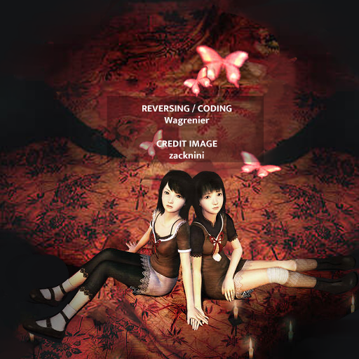
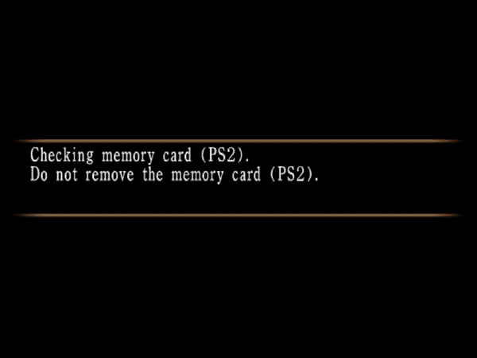

# Zero2Undub

## Undub project for Fatal Frame 2 PS2 (Project Zero 2零紅い蝶)

Includes:
* All assets that are smaller or equal size in the JP version will be undubbed
* Audio files that are larger are appended at the end of the archive file
* All FMV are undubbed, but some will retain the english text/logo
* Over 30 voice clips restored from the JP version
* All audio in Japanese!
* Custom splash screen

Next version:
* New more accurate subtitle (?)
* (Coming soon!) EU support

What this programs needs:
* Your owned copy of Fatal Frame 2 ISO (US)
* Your owned copy of Fatal Frame 2 ISO (JP)
* The [dotnet runtime 5.0.8](https://dotnet.microsoft.com/download/dotnet/5.0) -> select your platform on the right side
